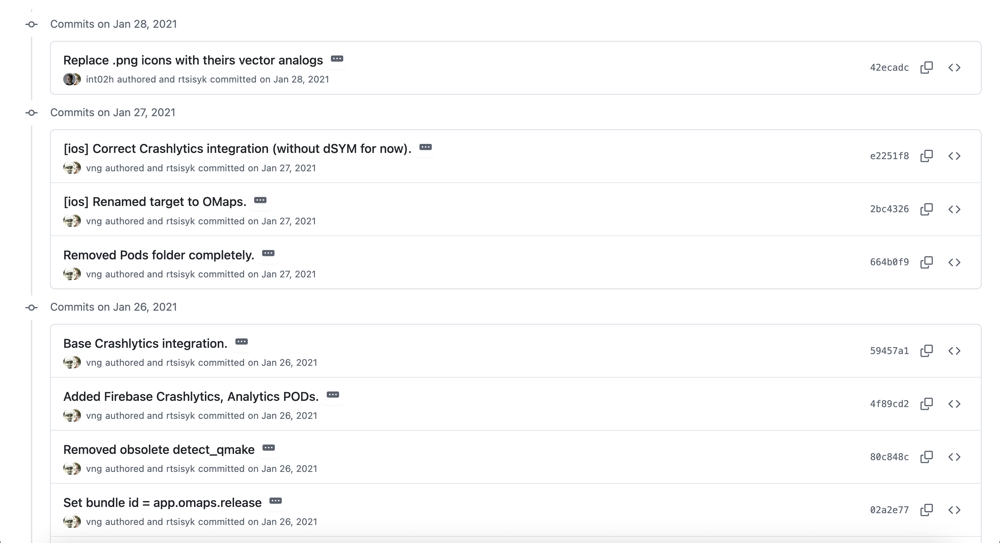
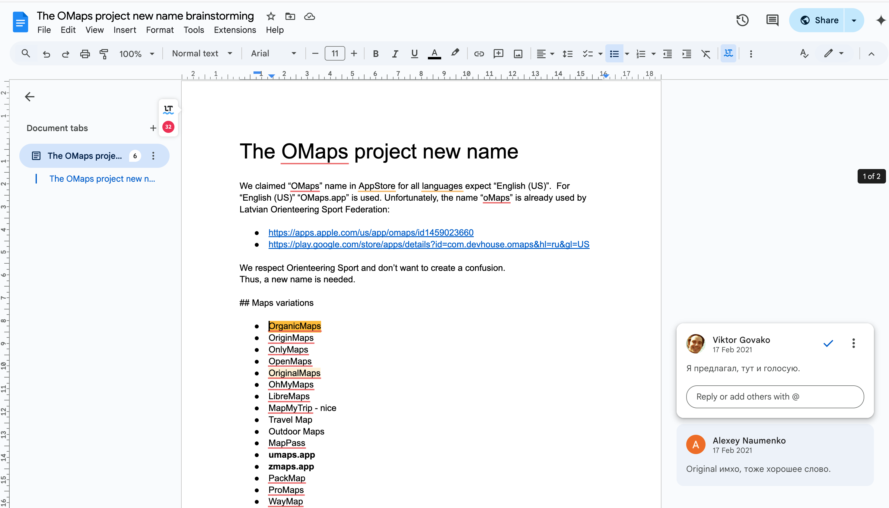
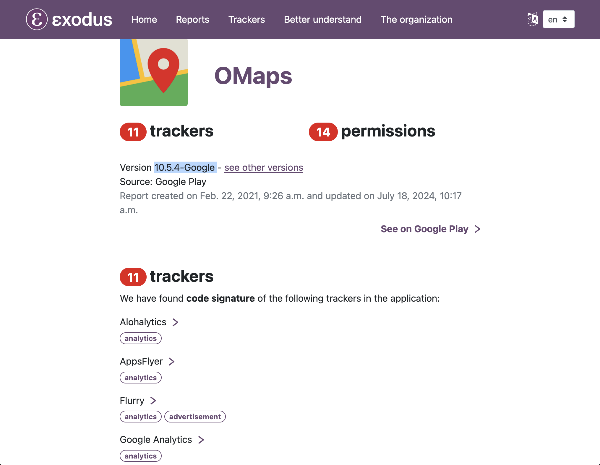
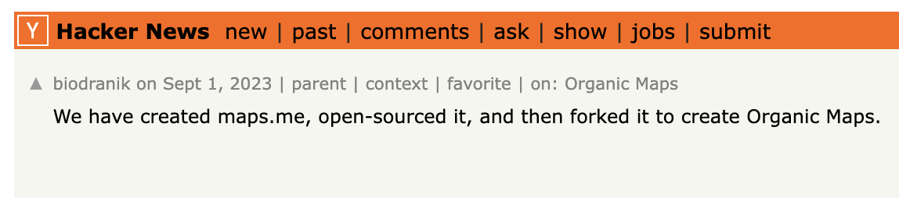

<!-- omit in toc -->
# History

This document aims to reconstruct the early history of the foundation of the Organic Maps ([initially](#rebranding) OMaps) project using publicly verifiable factual information. The purpose is to provide clarity to prevent the spread of misleading information and the fabrication of [alternative history](#alternative-history).

- [Background](#background)
- [Foundation](#foundation)
- [Fork](#fork)
- [Viktor's Fork](#viktors-fork)
- [Copyrights](#copyrights)
- [Rebranding](#rebranding)
- [Assets](#assets)
- [CI/CD](#cicd)
- [Release](#release)
- [Debloating](#debloating)
- [Company](#company)
- [Alternative History](#alternative-history)

## Background

On *December 20, 2020*, a completely rebuilt version of the **MAPS.ME** ([formerly known][mapsme_wikipedia] as **MapsWithMe**) app [got pushed][mapsme20_telegraph] to the Apple App Store. The update led to widespread [disappointment][mapsme20_reddit] from long-standing users, who felt it had [stripped away][mapsme20_telegraph] key features.

One widely shared [post][mapsme20_telegraph] included a link to a now-defunct Telegram group called ["MAPS.ME Original Project Updates"][originalmapsme_telegram]. In just a few days, [over 250][originalmapsme_telegram] longtime fans and open-source enthusiasts joined to brainstorm ways to revive the old MAPS.ME. Productive discussions soon followed on building a new open-source project using the remaining MAPS.ME open code.

## Foundation

This very project [was launched][omaps_governance] on *December 27, 2020* under the name **OMaps**. The letter “O” was left deliberately ambiguous and open to various interpretations like Original, Open, Outdoor, etc. The name **OMaps** was [revised](#rebranding) to **Organic Maps** [several months later](#rebranding) to [avoid potential conflicts with another project](#orienteering-sport). The official website ([omaps.app][omaps_website_captured]) and GitHub organization ([github.com/omapsapp][omaps_github_org_captured]) described **OMaps** as a *community-driven fork of MapsWithMe*, aiming to create *an open-source mobile app for Android and iOS that provides offline maps using OpenStreetMap data*.

The [initial founding][omaps_founders] team of **OMaps** ([rebranded](#rebranding) later to **Organic Maps**) [consisted of][omaps_founders] Roman Tsisyk ([@rtsisyk](https://github.com/rtsisyk), Interim Project Manager) and Alexey Naumenko ([@ooprizrakoo](https://github.com/ooprizrakoo), Community Manager) [(snap)](artifacts/2020-12-28-founders-of-omaps-organic-maps-project.png). The [governance documents][omaps_governance] outlined a board-led structure and affirm the initiative as *an independent open-source project and not controlled by any single company* [(snap)](artifacts/2020-12-28-omaps-organic-maps-founding-documents-by-roman-tsisyk.png). Importantly, none of the initial founding members were connected to the original MAPS.ME (MapsWithMe) [shareholders](#mapsme-shareholders) that [sold](#mapsme-shareholders) the proprietary MAPS.ME app to Mail.Ru Group back in 2014, while some of them [joined later](#viktors-fork).

The OMaps (Organic Maps) open-source project was bootstrapped by the [grand plan drafted by Roman Tsisyk][omaps_tickets]. The first 35 GitHub issues  (
   [#1](https://github.com/organicmaps/organicmaps/issues/1),
   [#2](https://github.com/organicmaps/organicmaps/issues/2),
   [#3](https://github.com/organicmaps/organicmaps/issues/3),
   [#4](https://github.com/organicmaps/organicmaps/issues/4),
   [#5](https://github.com/organicmaps/organicmaps/issues/5),
   [#6](https://github.com/organicmaps/organicmaps/issues/6),
   [#7](https://github.com/organicmaps/organicmaps/issues/7),
   [#8](https://github.com/organicmaps/organicmaps/issues/8),
   [#9](https://github.com/organicmaps/organicmaps/issues/9),
   [#10](https://github.com/organicmaps/organicmaps/issues/10),
   [#11](https://github.com/organicmaps/organicmaps/issues/11),
   [#12](https://github.com/organicmaps/organicmaps/issues/12),
   [#13](https://github.com/organicmaps/organicmaps/issues/13),
   [#14](https://github.com/organicmaps/organicmaps/issues/14),
   [#15](https://github.com/organicmaps/organicmaps/issues/15),
   [#16](https://github.com/organicmaps/organicmaps/issues/16),
   [#17](https://github.com/organicmaps/organicmaps/issues/17),
   [#18](https://github.com/organicmaps/organicmaps/issues/18),
   [#19](https://github.com/organicmaps/organicmaps/issues/19),
   [#20](https://github.com/organicmaps/organicmaps/issues/20),
   [#21](https://github.com/organicmaps/organicmaps/issues/21),
   [#22](https://github.com/organicmaps/organicmaps/issues/22),
   [#23](https://github.com/organicmaps/organicmaps/issues/23),
   [#24](https://github.com/organicmaps/organicmaps/issues/24),
   [#25](https://github.com/organicmaps/organicmaps/issues/25),
   [#26](https://github.com/organicmaps/organicmaps/issues/26),
   [#27](https://github.com/organicmaps/organicmaps/issues/27),
   [#28](https://github.com/organicmaps/organicmaps/issues/28),
   [#29](https://github.com/organicmaps/organicmaps/issues/29),
   [#30](https://github.com/organicmaps/organicmaps/issues/30),
   [#31](https://github.com/organicmaps/organicmaps/issues/31),
   [#32](https://github.com/organicmaps/organicmaps/issues/32),
   [#33](https://github.com/organicmaps/organicmaps/issues/33),
   [#34](https://github.com/organicmaps/organicmaps/issues/34),
   [#35](https://github.com/organicmaps/organicmaps/issues/35),
...) outlined a foundational roadmap that included rebranding, restoring key features, removing telemetry and ads, removing third-aprty integrations, and bootstraping basic project infrastructure to transform ruins of bloated MAPS.ME source code into a community-driven, open-source, privacy-focused maps & navigation app [(snap)](artifacts/2020-12-28-omaps-organic-maps-foundation-project-plan-by-founder-roman-tsisyk.png). The plan [expanded to more than 100 tickets ][omaps_tickets_expanded] over the course of one month.

The founding bootstrap issue [#1](https://github.com/organicmaps/organicmaps/issues/1) was marked as done and closed by Roman Tsisyk on *December 28, 2020 at 11:45 AM GMT* [(snap)](artifacts/2020-12-28-omaps-organic-maps-project-bootstraped-by-roman-tsisyk.png), along with a handful of other tasks outlined in the launch plan. The basic project infrastructure and social media channels were launched by the end of the day of *December 28, 2020* [(snap)](artifacts/2020-12-28-omaps-organic-maps-initial-infrastructure-by-roman-tsisyk.png):

 - [Governance document][omaps_governance], promising *an independent open-source project and not controlled by any single company*.
 - [omaps.app][omaps_website_captured] ([omaps.org][omaps_website_captured]) landing page (now [redirects](#rebranding-to-omaps) to https://organicmaps.app);
 - maps.omaps.app web interface based on uMap hosted on Scaleway (abandoned);
 - ci.omaps.app - CI/CD server on Hetzner;
 - [github.com/omapsapp][omaps_github_org_captured] GitHub organization and repositories;
 - gitlab.com/omapsapp/ - a mirror on GitLab;
 - omapsapp.slack.com - Slack Community (now decommissioned);
 - [twitter.com/omapsapp][omaps_twitter] - Twitter Account.
 - [t.me/omaps][omaps_telegram] - Telegram Group.

Almost the entire content of [omapsapp/community.wiki](https://github.com/organicmaps/community.wiki.git) was later [merged][omaps_docs_merged] into the main repository under the `docs/` directory. The project was eventually [rebranded](#rebranding) as **Organic Maps**, although traces of the original name can still be [found][omaps_xcode] throughout the Git history.

[ Telegram (t.me/omaps) group by Alexey Naumenko on December 28, 2020")][omaps_telegram]

[ website (omaps.app) on January 17, 2020")](https://web.archive.org/web/20210117122436/https://omaps.app/)

[ GitHub (github.com/omapsapp) website on January 19, 2020")](https://web.archive.org/web/20210119211202/https://github.com/omapsapp)

## Fork

Following the controversial launch of [MAPS.ME 2.0](#background), dozens of forks [appeared on GitHub][mapsme_forks], though most stalled at the starting line. The **current Git tree** of [organicmaps/organicmaps][organicmaps_github] (originally [omapsapp/omapsapp][omaps_github_captured]) diverged from the [mapsme/omim][mapsme_github] MAPS.ME upstream on *December 29, 2020* by the commit [9eebe39ce][omaps_fork] authored by Roman Tsisyk. This was followed by a series of commits, primarily by the same author, alongside changes imported from the MAPS.ME upstream.

[ Git fork from the MAPS.ME repository")][omaps_fork]

MAPS.ME team continued to update [the upstream](https://github.com/mapsme/omim) repository until the [final commit](mapsme_final_commit) made on *April 28, 2021*. Commits made by the Mail.Ru team to the [mapsme/omim][mapsme_github] repository after the fork date were later rebased and merged into the OMaps repository.

## Viktor's Fork

Viktor Govako, co-founder and former [shareholder](#mapsme-shareholders) of MapsWithMe (MAPS.ME), [joined][omaps_vng_joined] the OMaps GitHub organization on *January 24, 2021* [(screenshot)](artifacts/2021-01-24-viktor-govako-joins-omaps-organicmaps.png) and contributed [a series of iOS debloating commits][omaps_fork2] two days later, on *January 26, 2021*. Commits removed ads, in-app purchases, and the Facebook and Google SDKs from the **iOS** codebase.

[][omaps_fork2]

Commits contributed by Viktor were [DCO-signed](#fork), as required by the OMaps project, and some even referenced the names `OMaps` and `app.omaps`, indicating that they were intended for the OMaps project. However, some of them had [author dates][author_date] as early as *December 20, 2020*, suggesting they were likely drafted even before creation of the OMaps project on *December 27, 2020*.

There is good reason to believe that Viktor maintained his own fork, but that fork was **private** (proprietary) and never shown to the general public. An Internet Archive [snapshot](artifacts/2020-12-24-viktar-havaka-did-not-have-public-fork.png) of [@vng][vng]'s profile as of *December 24, 2020* shows no relevant public repositories other than "omim" from 2015. Had these useful commits been available earlier, why wouldn’t they have been picked up and merged into the [omapsapp/omapsapp][omaps_github_captured] repository earlier than on *January 26, 2021*, a month later?

The further development clearly [continued][omaps_github_organicmaps] using the public infrastructure and  [GitHub project][omaps_github_organicmaps] of OMaps.
 There is no doubt that Viktor made a significant impact on the project during its early months and beyond.

Alexander Borsuk, another co-founder of MapsWithMe, has been fabricating and spreading his [alternative history](#alternative-history) of the project, which is thoroughly [fact-checked and refuted](#alternative-history) later in this document.

## Copyrights

The upstream [mapsme/omim][mapsme_github] repository was copyrighted by *My.com B.V. (Mail.Ru Group)* and licensed under Apache 2.0, and so was the fork. Contributions were required signing a **Contributor License Agreement (CLA)**, under which contributors [relinquished their ownership rights in favor of the corporation][mapsme_cla]. The OMaps project from the first day of its existence [adopted][omaps_dco] the [Developer Certificate of Origin (DCO)](https://developercertificate.org/), effectively ending the harmful practice of transferring copyrights to the MAPS.ME company.

Commits from Mail.Ru Group team before and after [*December 29, 2020*](#fork) do not include a [Developer Certificate of Origin (DCO)](#dco) signature and, to the best of the knowledge, should remain [copyrighted](#Copyrights) by My.com B.V. (Mail.Ru Group). All new code added since the fork (excluding changes from the Mail.Ru team) is copyrighted by the respective authors. Re-licensing the code is not realistically possible, as it would require consent from all contributors as well as from My.com B.V. (Mail.Ru Group) and/or its successors.

## Rebranding

The project was initially [launched](#foundation) under the name **OMaps**, with the letter “O” left deliberately ambiguous and never officially defined. The technical replacement of strings from **"MAPS.ME"** to **"OMaps"** was initially performed by [Roman Tsisyk][omaps_rebranding_roman] and [Veniamin Gvozdikov][omaps_rebranding_veniamin] on *December 31, 2020*, although [some leftovers still remain in the repository][omaps_xcode] as of 2025.

On *February 17, 2021*, Roman Tsisyk published a [document][omaps_rebrading_document] titled "The OMaps Project New Name", proposing to brainstorm a new name for the project:

> We claimed “OMaps” name in AppStore for all languages expect “English (US)”.  For  “English (US)” “OMaps.app” is used. Unfortunately, the name “oMaps” is already used by Latvian Orienteering Sport Federation:

The option **Organic Maps** seems to be proposed by [Viktor Govako](#viktors-fork), who commented in Russian on the same day: "Я предлагал, тут и голосую." ("I proposed it, and here I am voting for it").

The domain name organicmaps.app was registered as early as *December 20, 2020*. However, there is no public record indicating that this name was used until the rebranding from *OMaps* to *Organic Maps* happened around *April 14-16, 2021*.

The **first-ever** archived [snapshot][organicmaps_website_rebranding] of [organicmaps.app][organicmaps_website], dated *April 14, 2021*, still refers to the project as "**The OMaps Project**" alongside "**(c) 2021 Organic Maps Contributors**", indicating the early steps in rebranding the [OMaps website](artifacts/2021-01-17-omaps-organic-maps-website-archived.png):

>
>  © 2021 The **Organic Maps** Contributors
>
> The **OMaps** Project is not affiliated, associated, authorized, endorsed by, or in any way officially connected with My.Com B.V., Mail.Ru Group, MAPS.ME.

The **first-ever** archived [snapshot][organicmaps_github_rebranding] of [organicmaps/organicmaps][organicmaps_github_rebranding] GitHub repo, captured by the Internet Archive on *April 16, 2021*, still shows the name **OMaps** was still **referenced** in the README, suggesting that it was renamed/rebranding repo of OMaps:

The current actual repository of **Organic Maps** retains the [full git history](#fork), and the most original governance documents of the **OMaps** project. The Internet Archive [snapshot][omaps_github_organicmaps] from recent days shows that [https://github.com/omapsapp/omapsapp](https://github.com/omapsapp/omapsapp) was redirecting to [https://github.com/organicmaps/organicmaps](https://github.com/organicmaps/organicmaps), which happens during renaming of projects on GitHub.

There is absolutely no doubt that **Organic Maps** was simply a rebranding of the **OMaps** project, carried out by contributors to **OMaps** project under the governance and rules of the **OMaps** project.

## Assets

The original NOTICE file in the [github.com/mapsme/omim][mapsme_github] repository ended with a rather annoying clause, stating that "all images and media content" were copyrighted and excluded from the Apache 2.0 license.

> All images and media content **are Copyright (C) 2020 My.com B.V. (Mail.Ru Group)**

Interestengly, but the [initial version][mapsme_borsuk_changed_license] of the `NOTICE` file in 2015 licensed all images and media under the CC BY 4.0 license. However, **Alex Zolotarev** (also known as **Alexander Borsuk**, [*biodranik*][biodranik], [*deathbaba*][deathbaba]), [co-founder](#mapsme-shareholders) of **MAPS.ME**, later [removed][mapsme_borsuk_changed_license] the CC BY 4.0 license and made all icons and media content proprietary.

Contributors undertook systematic effort to [audit and replace][omaps_assets_audit] all non-trivial image assets of unclear copyright status with libre-licensed alternatives, notable:

- *January 1, 2021*: The logo was [introduced][omaps_assets_libre1] by Roman Tsisyk.
- *January 28, 2021*: Android icons were partially [replaced][omaps_assets_libre2] by Daniil Popov.
- *March 6, 2021*: Almost all non-trivial graphics were [removed][omaps_assets_libre3] by Roman Tsisyk.
- *April 3, 2021*: A bunch of **508** icons was [replaced][omaps_assets_libre4] with libre alternatives by Roman Tsisyk.

The further work of replacing assets copyrighted was continued by new contributors, but this falls outside the scope of the time frame covered by this document.

## CI/CD

The initial implementation of the CI/CD system for Android was [contributed][omaps_cicd] by Roman Tsisyk on *December 29, 2020*, and later extended with enhancements on *January 4, 2021* [(snap)](artifacts/2021-01-04-omaps-organic-maps-ci-ci-message-telegram.png) and iOS support on *January 5, 2021*. The original MAPS.ME repository did not include any public CI/CD infrastructure.

[ by Roman Tsisyk on January 4, 2021")][omaps_cicd_source]

## Release

The **first-ever Android**  version was [published][omaps_firebase] on Firebase App Distribution as early as on *January 4, 2021*. The Google Play [had approved][omaps_googleplay] the app under the application id `app.omaps` on *January 6, 2021 19:50 UTC* (posted on Telegram on *Jan 7, 2021*).

 was approved by Google Play on January 6, 2021.")

The Internet Archive captured a [snapshot][omaps_googleplay_snapshot] of `app.omaps` on Google Play dated *April 16, 2021*, shortly after the [rebranding](#rebranding) from OMaps to Organic Maps. The app was re-published under the new identifier `app.organicmaps` later in *June, 2021*.

The **first-ever iOS** version was [published][omaps_testflight] on Apple TestFlight as early as on *January 31, 2021*.

## Debloating

The removal of ads and trackers [began][omaps_cleanup1] as early as *January 1, 2021*. Viktor Govako [contributed][omaps_cleanup2] a major (2998 deletions(-) not counting 3party Pods) cleanup of iOS codebase on *January 26, 2021*. Roman Tsisyk [contributed][omaps_cleanup3] a major (5943 deletions(-)) cleanup of the Android codebase on *March 6, 2021*.

As of *February 22, 2021*, Exodus Privacy [shown 11][omaps_exodus1] leftover trackers inherited from MAPS.ME code.

[][omaps_exodus1]

Initial work on the **F-Droid** version was [started](omaps_fdroid) by Roman Tsisyk on *March 7, 2021*, under the application ID `app.omaps`. After the [rebranding](#rebranding), the F-Droid team [merged it](organicmaps_fdroid) under the new application ID `app.organicmaps` on *May 15, 2021*.

 early F-Droid adaptation on March 7, 2021.")

AS of March 20, 2021, Exodus Privacy [shown just 2][omaps_exodus2] trackers, which were part of Firebase crash reportinting, enabled in the beta version distributed via Firebase, but were not active in the production release.

Effectively, the removal of trackers was mostly completed in *March 6-7, 2021*.

## Company

**Organic Maps OÜ** is a legal entity registered in Estonia, was [founded][organicmaps_company] on *May 7, 2021* by **Viktor Govako** and **Roman Tsisyk**  ([source][organicmaps_company]). The company manages certain project resources, including but not limited to domain names, trademarks, hosting accounts, payment accounts, and others ([source][organicmaps_company_disclaimer]).

## Alternative History

Alexander Borsuk (a.k.a. [deathbaba][deathbaba]), co-founder of MAPS.ME, edited the [Wikipedia article][alternative_history_wikipedia] to state that Organic Maps started on *December 21, 2020* by Viktor Govako and Alexander Borsuk, while Roman Tsisyk joining Viktor and Alexander later on *January 7, 2021*. This version of events contradicts the factually documented sequence of events outlined in this document.

[ to Wikipedia article")][alternative_history_wikipedia]

Alexander Borsuk, co-founder of MAPS.ME (MapsWithMe), has [promoted][alternative_history_hackernews] a narrative stating "We created maps.me, open-sourced it, and then forked it to create Organic Maps". This statement does not align with the factual timeline and evidence provided in the document.

[][alternative_history_hackernews]

Alexander Borsuk, co-founder of MAPS.ME (MapsWithMe), [lists][alternative_history_alexbio] himself as a co-founder of Organic Maps on his personal CV website. The documented project timeline and publicly accessible records suggest that this claim does not accurately represent Alexander’s level of involvement into the

[")][alternative_history_alexbio]

The following timeline provides basic **fact-checking** based on **factual, publicly available sources**, including a few relevant milestones from the history of MapsWithMe (MAPS.ME):

- *April 2012* - Belarusian startup MapsWithMe founded by Yury Melnichek, Alexander Zolotarev (a.k.a *Alexander Borsuk*, [*biodranik*][biodranik], [*deathbaba*][deathbaba]), Viktor Govako (a.k.a *Viktor Havaka*, [*vng*][vng]) and Siarhei Rachytski wins Startup Monthly competition in Vilnius.

- *July 2014* — The MapsWithMe app was rebranded to MAPS.ME. It is safe to assume that app was proprietary and it wasn't an open-source project, as the source code was published by Mail.Ru Group later in 2015 (see below).

- *November 2014* — My.com B.V. (Mail.Ru Group) [acquired][mailru_aquires_mapsme] the MAPS.ME (MapsWithMe) app for approximately [$18 million][mailru_sells_mapsme]. [The last public records of MapsWithMe GmbH](https://www.shab.ch/shabforms/servlet/Search?EID=7&DOCID=1432311), which published the app before its acquisition, list Yury Melnichek (37.5%), Yauheniya Melnichek (2.4%), Alexander Zolotarev (27.8%), Viktar Havaka (27.8%), and Siarhei Rachytski (4.5%) as shareholders.

- *September 30, 2015* — My.com B.V. (Mail.Ru Group) published the source code of the MAPS.ME app under the Apache 2.0 license. Alexander Zolotarev (also known as *Alexander Borsuk*, [*biodranik*][biodranik], [*deathbaba*][deathbaba]) made his mark on the release by [removing](#assets) the CC BY 4.0 license from *all images and media assets*, which creates a headache for OMaps (Organic Maps) in 2020–2021.

- *November 2, 2020* - Mail.ru Group [sells][mailru_sells_mapsme] the app to Daegu Limited (member of Parity.com Group) for about $20M.

- *December 20, 2020* — Daegu Limited started the [controversial MAPS.ME 2.0 update rollout](#background).

- *December 21, 2020* — The date Alexander Borsuk [claims on Wikipedia][alternative_history_wikipedia] as the day he founded the project, though this differs from the factually documented sequence of events outlined in this document.

- *Decemeber 27, 2020* — The OMaps project (later rebranded as Organic Maps) [began](#foundation) as a community-driven fork of the publicly available MapsWithMe (MAPS.ME) source code was started Roman Tsisyk and Alexey Naumenko as its founding members.

- *Decemeber 28, 2020* — The [first message][omaps_telegram] in the OMaps (now Organic Maps) Telegram channel was posted by Alexey Naumenko.

- *Decemeber 29, 2020* - Roman Tsisyk contributed a series of [commits](#fork), effectively diverging the repository from MAPS.ME's upstream.

- *December 29, 2020* - Roman Tsisyk [implemented](#cicd) CI/CD for the Android.

- *January 4, 2021* - The first-ever Android version [published](#release) on Firebase App Distribution.

- *January 5, 2021* - Roman Tsisyk [implemented](#cicd) CI/CD for the iOS.

- *January 7, 2021* — The first Android version of OMaps [published](#release) on Google Play.

- *January 24, 2021* — Viktor Govako, co-founder & former [shareholder](#mapsme-shareholders) of the MapsWithMe (MAPS.ME) [joined][omaps_vng_joined] the GitHub organization of OMaps ([screenshot](artifacts/2021-01-24-viktor-govako-joins-omaps-organicmaps.png)). Note: GitHub displays the organization's current name after [rebranding](#rebranding).

- *January 26, 2021* — Viktor Govako [published](#viktors-fork) [a bunch of debloating iOS commits][omaps_fork2], effectively eliminating ads and telemetry in iOS, though some leftovers of dead and deactivated code may have remained in the codebase.

- *January 31, 2021* — The first-ever iOS version [published](#release) on Apple TestFlight.

- *January 31, 2021* - Alexander Borsuk’s GitHub profile [showed no evidence](docs/artifacts/2021-01-16-alexander-borsuk-no-traces-of-contributions-to-omaps-organic-maps.png
) whatsoever of any involvement with Organic Maps (OMaps).

- *February 17, 2021* — Viktor Govako [proposed](#rebranding) the name Organic Maps during the brainstorming for a new name for the OMaps project.

- *February 19, 2021* - Alexander Borsuk, co-founder & former [shareholder](#mapsme-shareholders) of MapsWithMe (MAPS.ME), [joined][omaps_biodranik_joined_telegram] [(snap)](artifacts/2021-02-19-alexander-borsuk-joined-omaps-organic-maps-telegram.png) the Telegram group of OMaps ([now](#rebranding) - Organic Maps).

- *February 25, 2021* — Alexander Borsuk [joined][omaps_biodranik_joined_github] the GitHub organization of OMaps ([screenshot](artifacts/2021-02-25-alexander-borsuk-joins-omaps-organic-maps-github.png)). Note: GitHub displays the organization's current name after [rebranding](#rebranding).

- *March 5, 2021* — Alexander Borsuk made his **first-ever** contribution to the project repository by submitting a [two-line workaround][omaps_biodranik_contributed1].

- *March 6, 2021* — Roman Tsisyk [removed][omaps_assets_libre3] nearly all non-trivial copyrighted graphics from MAPS.ME, as the CC-BY 4.0 license for "all images and media content" was [stripped out](#assets) by Alexander Borsuk back in 2015.

- *March 6, 2021* — Roman Tsisyk [contributed](#debloating) a major (5943 deletions(-)) cleanup of the Android codebase from ads and trackers, effectively ending ads and telemetry in Android, though some leftovers of dead and deactivated code may have remained in the codebase.

- *March 10-20, 2021* — Alexander Borsuk contributed dozens of [minor low-impact fixes][omaps_borsuk3] like "Updated boost to 1.75", "Newline warning fixes", "C++ warning fixes", "[ios] Warning fixes", "[ios] Nullable warning fixes", etc.

- *April 3, 2021* - Roman Tsisyk [replaces][omaps_assets_libre4] 508 copyrighted icons, still dealing with the consequences of the licence change by Alexander Borsuk back in 2015.

- *April 14, 2021* - The **first-ever** archived [snapshot][organicmaps_github_rebranding] of the [organicmaps/organicmaps][organicmaps_github_rebranding] GitHub repo captured by the Internet Archive, still mentioning the name OMaps in the README.

- *April 16, 2021* — The **first-ever** archived [snapshot][organicmaps_website_rebranding] of the [organicmaps.app][organicmaps_website_rebranding] captured by the Internet Archive, still mentioning the name OMaps in the footer.

- *May 7, 2021* - Viktor Govako and Roman Tsisyk registered [Organic Maps OÜ](#company).

This document is intended to conclude here. The facts speak for themselves.

[alternative_history_alexbio]: https://github.com/biodranik/alex.bio/commit/c92da2b0a8d13ffc381b9557d6ff28423f4d511d
[alternative_history_hackernews]: https://news.ycombinator.com/item?id=37348127
[alternative_history_wikipedia]: https://en.wikipedia.org/w/index.php?title=Organic_Maps&diff=prev&oldid=1286580366
[alternative_history]: https://en.wikipedia.org/wiki/Alternate_history
[author_date]: https://graphite.dev/guides/git-commit-date#what-are-commit-dates
[biodranik]: https://github.com/biodranik
[deathbaba]: https://web.archive.org/web/20161005034826/http://deathbaba.github.io/
[mailru_aquires_mapsme]: https://vk.company/en/press/releases/9209/
[mailru_sells_mapsme]: https://vk.company/en/investors/info/10761/
[mapsme_borsuk_changed_license]: https://github.com/mapsme/omim/commit/5e4fe7b90b32ce4c59a9b49ccc848b3d36bcffe5
[mapsme_cla]: https://github.com/mapsme/omim/commit/96d1a98ee430acbad805513db85ce43a23cc7b2a
[mapsme_copyrights]: https://github.com/mapsme/omim/commit/0600d58f69fe586434b91f09ac38dca53aa03325
[mapsme_final_commit]: https://github.com/mapsme/omim/commit/1892903b63f2c85b16ed4966d21fe76aba06b9ba
[mapsme_forks]: https://github.com/mapsme/omim/network
[mapsme_github]: https://github.com/mapsme/omim
[mapsme_wikipedia]: https://en.wikipedia.org/wiki/Maps.me
[mapsme20_hackernews]: https://news.ycombinator.com/item?id=25515004
[mapsme20_reddit]: https://www.reddit.com/r/openstreetmap/comments/khsjqx/mapsme_seems_have_reached_its_end/
[mapsme20_telegraph]: https://telegra.ph/What-happened-to-the-old-MAPSME-12-20
[omaps_assets_audit]: https://docs.google.com/spreadsheets/d/1trliZW_VhaQ05h335NopBuIXhcRkvE7e
[omaps_assets_libre1]: https://github.com/organicmaps/organicmaps/commit/44945795f5680416ea07ed3ace4ee43250f3d54f
[omaps_assets_libre2]: https://github.com/organicmaps/organicmaps/commit/42ecadc118bc7d6fba62e01a0c2e3d265d854c44
[omaps_assets_libre3]: https://github.com/organicmaps/organicmaps/commit/1954dd8a7ef5f89f8260908c6c4295d8f2cc68d8
[omaps_assets_libre4]: https://github.com/organicmaps/organicmaps/commit/1bc11bf1326f45661cb10f9537749c978f8620a8
[omaps_biodranik_contributed1]: https://github.com/organicmaps/organicmaps/commit/3043771e5e7195e5ba067c480cdcee9ed46cd2b8
[omaps_biodranik_contributed2]: https://github.com/organicmaps/organicmaps/commit/4dc8a9d276180fc946a9293a9afafa8c24eb11ac
[omaps_biodranik_joined_github]: https://github.com/biodranik?tab=overview&from=2021-02-01&to=2021-02-28
[omaps_biodranik_joined_telegram]: https://t.me/organicmaps/777
[omaps_borsuk1]: https://github.com/organicmaps/organicmaps/commit/3043771e5e7195e5ba067c480cdcee9ed46cd2b8
[omaps_borsuk2]: [4dc8a9d276180fc946a9293a9afafa8c24eb11ac](https://github.com/organicmaps/organicmaps/commit/4dc8a9d276180fc946a9293a9afafa8c24eb11ac)
[omaps_borsuk3]: https://github.com/organicmaps/organicmaps/compare/daf0dfc2a1bd440fabb162d9a96b2f466715c0e2...03f5296eb34f79c1766b9015249f9698a15ce197
[omaps_cicd_source]: https://t.me/organicmaps/40
[omaps_cicd]: https://github.com/organicmaps/organicmaps/commits/master/.github/workflows?after=eba3cf1f4535d91d9bd0f948c9046a086fb4ff76+0
[omaps_cleanup1]: https://github.com/organicmaps/organicmaps/commit/1eb8789bb4ffb5e15d6bebfdfa7464cc4c37f4eb
[omaps_cleanup2]: https://github.com/organicmaps/organicmaps/compare/d3e4976b33b68b17939c7421b320f07a1cf7ff05...de1641b65f7c23bf49015d664d586919c611f1bc
[omaps_cleanup3]: https://github.com/organicmaps/organicmaps/commit/48e2dd708554d138f12c12b7c6ebac6b75906cc8
[omaps_dco]: https://github.com/organicmaps/organicmaps/commit/478783d84bdd6993e719904f2be8770ae19075da
[omaps_docs_merged]: https://github.com/organicmaps/organicmaps/commit/375d0d3497c531df37b8c7e493a38c17fc29f4b2
[omaps_exodus1]: https://reports.exodus-privacy.eu.org/en/reports/165935/
[omaps_exodus2]: https://reports.exodus-privacy.eu.org/en/reports/170228/
[omaps_fdroid]: https://gitlab.com/fdroid/rfp/-/issues/1665
[omaps_firebase]: https://t.me/organicmaps/85
[omaps_fork]: https://github.com/organicmaps/organicmaps/compare/c23a186e3a093557cd730039ae751dd1a1ab2604...8cf2d10dbfa6ce96c43bdfc888e369040ea8b780
[omaps_fork2]: https://github.com/organicmaps/organicmaps/compare/cd5c20b533a50da7775c766085936f4e72e7975a...2bc43266c2d6bd5bedac388560c7c8757fb860e7
[omaps_fork3]: https://web.archive.org/web/20210201172519/https://github.com/omapsapp/omapsapp
[omaps_founders]: https://github.com/organicmaps/community/wiki/Members/891f8f0e3e1f0343c6282fed5a33a11925da08c8
[omaps_github_captured]: https://web.archive.org/web/20210203121716/https://github.com/omapsapp/omapsapp
[omaps_github_org_captured]: https://web.archive.org/web/20210119211202/https://github.com/omapsapp
[omaps_github_organicmaps]: https://web.archive.org/web/20250427162526/https://github.com/omapsapp/omapsapp/issues
[omaps_googleplay_snapshot]: https://web.archive.org/web/20210416091141/https://play.google.com/store/apps/details?id=app.omaps
[omaps_googleplay]: https://t.me/organicmaps/139
[omaps_governance]: https://github.com/organicmaps/community/wiki/Governance/877026156f39406a3c34d1f43a653152b585e739
[omaps_infrastructure]: https://github.com/organicmaps/community/wiki/Infrastructure/c5387c47785f2fc3dbdd9b9a71e8cfed16e2b04e
[omaps_rebrading_document]: https://docs.google.com/document/d/1qX9NEdPqEPLzcOZPBDOU4D1hcajUWOmi2ug8pWkSF68/edit
[omaps_rebranding_roman]: https://github.com/organicmaps/organicmaps/commit/85a3b8c47df60ef1ccf2ec581c61efc06ab1a839
[omaps_rebranding_veniamin]:  https://github.com/organicmaps/organicmaps/commit/d9c6dcaba409053b3c0d04557c65617f7bbaf58a
[omaps_rebranding_viktor]: https://github.com/organicmaps/organicmaps/commit/2bc43266c2d6bd5bedac388560c7c8757fb860e7
[omaps_telegram]: https://t.me/organicmaps/1
[omaps_testflight]: https://t.me/c/1495267990/398
[omaps_tickets]: https://github.com/organicmaps/organicmaps/issues?q=is%3Aissue%20created%3A2020-12-27..2020-12-28%20sort%3Acreated-asc
[omaps_tickets_expanded]: https://github.com/organicmaps/organicmaps/issues?q=is%3Aissue%20created%3A2020-12-27..2021-02-01%20sort%3Acreated-asc
[omaps_twitter]: https://x.com/omapsapp
[omaps_vng_joined]: https://github.com/vng?tab=overview&from=2021-01-01&to=2021-01-30
[omaps_website_captured]: https://web.archive.org/web/20210117122436/https://omaps.app/
[omaps_xcode]: https://github.com/organicmaps/organicmaps/blob/2231c6850296e819f34f6f0d84a467718081e98d/iphone/Maps/Maps.xcodeproj/project.pbxproj#L4118
[organicmaps_company_disclaimer]: https://github.com/organicmaps/organicmaps/blob/b8434224a2c728d0ec86179680a7014650d5faef/LEGAL#L1
[organicmaps_company]: https://ariregister.rik.ee/eng/company/16225385/Organic-Maps-O%C3%9C
[organicmaps_fdroid]: https://gitlab.com/fdroid/fdroiddata/-/commit/2360a00d7ab0740ff28cc91196f7726d36878480
[organicmaps_github_rebranding]: https://web.archive.org/web/20210416091133/https://github.com/organicmaps/organicmaps
[organicmaps_github]: https://github.com/organicmaps/organicmaps
[organicmaps_website_rebranding]: https://web.archive.org/web/20210414025201/https://organicmaps.app/
[organicmaps_website]: https://organicmaps.app
[originalmapsme_telegram]: https://web.archive.org/web/20201223082946/https://t.me/originalmapsme
[vng]: https://github.com/vng
